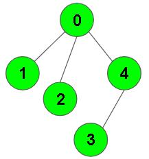

# DFS of Graph
Given a connected undirected graph. Perform a Depth First Traversal of the graph.

## Example
Input

Output: 0 1 2 4 3

Explanation: 
- 0 is connected to 1, 2, 4.
- 1 is connected to 0.
- 2 is connected to 0.
- 3 is connected to 0.
- 4 is connected to 0, 3.
  
So the dfs will be 0 1 2 4 3.